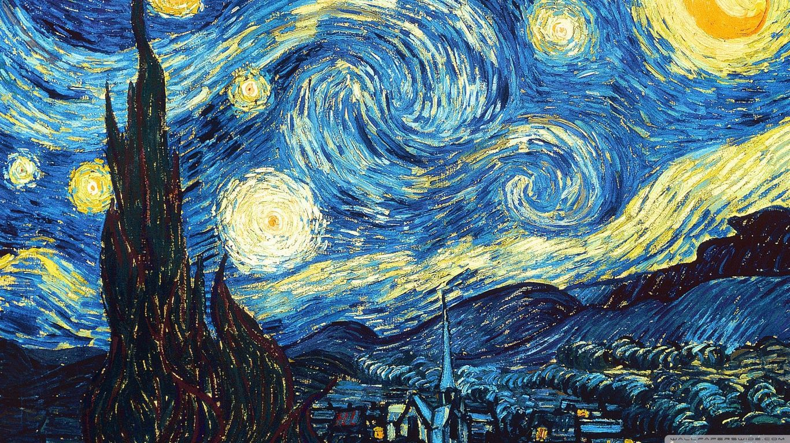
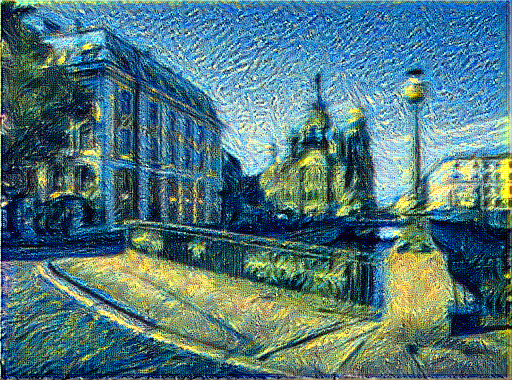

# Neural Style Transfer

This project implements neural style transfer that applies style of one image to content of another image to generate artistic images. 

## Overview
* This project is an application of Deep Learning and Convolutional Neural Network. Neural Style Transfer is a popular technique in Computer Vision and Image Processing.

* This project provides an implementation of Neural Style Transfer using Tensorflow and pre-trained InceptionV3 network. It allows you to experiment with different content and style image to generate unique artistic image.

## Examples

Here is one example of the stylised generated image using the project.

<table>
  <tr>
    <td align="center">Content Image</td>
     <td align="center">Style Image</td>
     <td align="center">Generated Image</td>
  </tr>
  <tr>
    <td></td>
    <td></td>
    <td></td>
  </tr>
 </table>

## References
* Research Paper: https://arxiv.org/abs/1508.06576
* https://www.tensorflow.org/tutorials/generative/style_transfer#:~:text=Neural%20style%20transfer%20is%20an,of%20the%20style%20reference%20image.
* https://towardsdatascience.com/light-on-math-machine-learning-intuitive-guide-to-neural-style-transfer-ef88e46697ee
